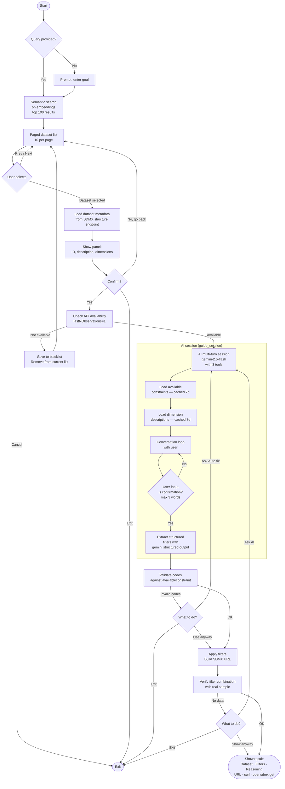

# `opensdmx guide` — workflow

## Summary

The `opensdmx guide` command leads the user from a natural-language goal to a ready-to-use SDMX data URL, in six main phases.

**Phase 1 — Query.** If not provided as an argument, the query is requested interactively. Any language is accepted.

**Phase 2 — Dataset selection.** The query is compared semantically against the embeddings of the provider catalog (Ollama `nomic-embed-text-v2-moe`). Results are shown in a paged list (10 at a time, sorted by score). The user navigates and selects a dataset.

**Phase 3 — Confirmation and availability check.** A panel shows the dataset ID, description, and dimensions. The user confirms or returns to the list. If confirmed, an API check is performed with `lastNObservations=1`: if the dataset does not respond correctly it is added to the SQLite blacklist and removed from the current result list, then the selection restarts.

**Phase 4 — AI session.** A multi-turn conversation starts with Gemini 2.5 Flash. The model loads the values actually available for each dimension (from `availableconstraint`, cached 7 days) and the textual descriptions of codes (from codelists, cached 7 days). The user describes what they want; the AI proposes filters using only real codes. When the user confirms with a short input (e.g. "ok", "yes"), filters are extracted in structured form.

**Phase 5 — Validation.** The codes proposed by the AI are checked against `availableconstraint`. If any codes are invalid, the user can return to the AI with corrections or proceed anyway. A sample request is then made with the full filter combination: if it returns no data, the user is offered the option to ask the AI for an alternative or to display the URL anyway.

**Phase 6 — Result.** A panel shows the dataset, active filters, AI reasoning, SDMX URL, `curl` command, and `opensdmx get` command ready for download.

---

## Flowchart

---

## Steps described

| Step | Description |
|---|---|
| Semantic search | `opensdmx embed` pre-builds embeddings; search uses cosine similarity on Ollama `nomic-embed-text-v2-moe` |
| Availability check | Request with `lastNObservations=1`; if it fails the dataset goes to the SQLite blacklist and disappears from the list |
| AI session | Multi-turn chat with Gemini 2.5 Flash; tools `lookup_actual_values` and `lookup_dimension_values` use the SQLite cache (7d) |
| Code validation | Comparison between AI-proposed codes and those present in `availableconstraint` |
| Combination validation | Real sample with active filters; if empty, offers to return to the AI |
| Result | SDMX URL · `curl` command · `opensdmx get` command ready for download |

## Tools available to the AI

| Tool | Purpose |
|---|---|
| `lookup_actual_values(dim)` | Codes **actually present** in the dataset (from `availableconstraint`, cached) |
| `lookup_dimension_values(dim)` | Textual descriptions of codes (from codelist, cached) |
| `test_filter_combination(**kwargs)` | Verifies that a filter combination returns real data |

---

## Caching

| Resource | Cache location | TTL |
|---|---|---|
| Dataflow list | `~/.cache/opensdmx/{AGENCY_ID}/dataflows.parquet` | 24h |
| Embeddings | `~/.cache/opensdmx/{AGENCY_ID}/embeddings.parquet` | No expiry |
| Dimensions | SQLite `~/.cache/opensdmx/{AGENCY_ID}/cache.db` | 7 days |
| Codelist values | SQLite `cache.db` | 7 days |
| Available constraints | SQLite `cache.db` | 7 days |
| Invalid datasets | SQLite `cache.db` | Permanent |

---

## Known limitations

- `availableconstraint` shows values present in the dataset overall, but not all combinations are valid (e.g. a code valid at national level may not exist at regional level for a specific data type).
- `test_filter_combination` mitigates this: it verifies that the full combination produces real data.
- Rate limit for ISTAT: 13 seconds between API calls.
